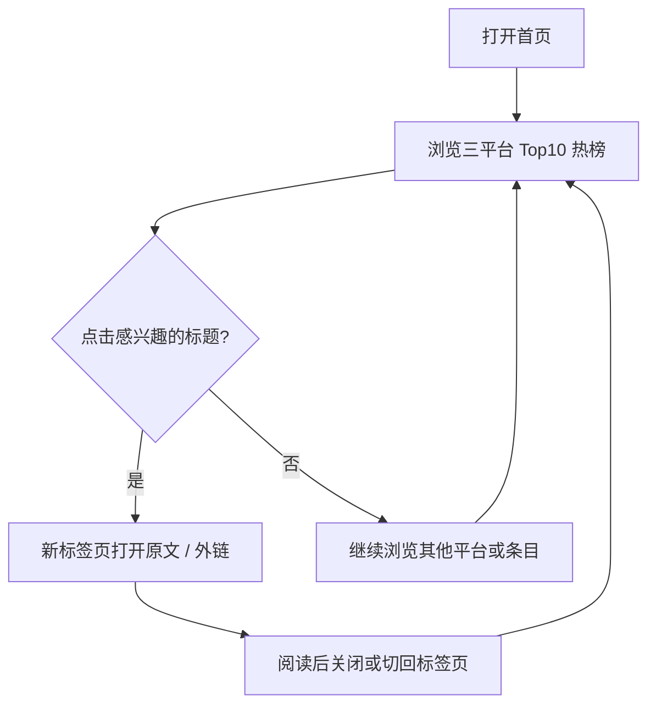

# news-search · 产品需求文档（PRD）

> 文档版本：v1.4 · 最后更新：2026-05-27  
> **文档分工**：PRD 定义「做什么、怎么验收」；技术细节、API 契约、风险、指标与监控见 [`RESEARCH.md`](./RESEARCH.md)。

---

## 一、产品概述

news-search 是一个多平台热点聚合网站。

**MVP 当前聚合（Phase 0~3）：**

- 小红书热榜
- B站热搜
- 知乎热榜

**未来扩展（Phase 4+，非 MVP）：**

- AI 热点资讯
- 医药行业动态
- QC 行业热点

**长期愿景：**

让用户通过一个页面快速浏览：大众热点 + AI 热点 + 行业资讯。

> **MVP 说明**：第一版仅上线三平台热榜；副标题可提及 AI/行业方向，但不在 MVP 内交付 AI/QC 模块（见第十三节）。

---

## 二、产品目标

### 2.1 当前目标（MVP）

完成一个 **可运行 · 可访问 · 可部署** 的热点聚合网站。

必须支持：

- 多平台热点展示（每平台 Top 10）
- 热点跳转（MVP-A 可用 `#`；MVP-B 需真实 `url`）
- 更新时间展示（卡片底部 + 可选全局）
- 前端对接 `GET /api/hot`
- 基础缓存（后端 5~10 分钟）
- 响应式布局（桌面 3 列 / 手机 1 列）
- 加载与错误态（见 4.3）

### 2.2 长期目标

逐步扩展为 **AI + QC + 自动化** 方向的信息聚合入口（见第十三节）。

---

## 三、目标用户

### 用户1：普通热点浏览用户

需求：快速查看热门内容（榜单、热度、更新时间）。

### 用户2：AI 从业者

需求：关注 AI 新闻、大模型、Agent 动态。（**Phase 4+**）

### 用户3：医药 / QC 行业用户

需求：关注医药资讯、QC 行业动态、自动化趋势。（**Phase 4+**）

> 用户 2/3 的长期需求（筛选、订阅、收藏）不在 MVP，见第十节。

### 3.1 核心用户路径

MVP 主路径（普通热点浏览用户）：

```txt
用户打开首页
    ↓
浏览三平台热点
    ↓
点击标题跳转
    ↓
返回继续浏览
```



| 步骤 | 用户行为 | 产品要求 |
|------|----------|----------|
| 1. 打开首页 | 进入「今日热搜」 | 3 秒内看到内容或 Loading；三卡布局清晰 |
| 2. 浏览热点 | 扫 rank / title / heat | Top 10；1~3 名高亮；卡底有更新时间 |
| 3. 点击标题 | 查看详情 / 原文 | MVP-A：`#` 占位；MVP-B：新标签 + 真实 `url` |
| 4. 返回浏览 | 继续看其他条目或平台 | 首页状态保持；无需登录；可手动刷新 |

**路径外（MVP 不覆盖）**：搜索、收藏、登录、跨设备同步浏览记录。

---

## 四、核心功能（MVP）

### 4.1 首页

#### Header

| 元素 | 内容 |
|------|------|
| 网站标题 | 今日热搜 |
| 副标题 | 快速浏览多平台热点，持续关注 AI 与行业动态 |

#### 热点卡片区

- **数量**：3 张卡片
- **平台**：小红书热榜、B站热搜、知乎热榜
- **每卡条数**：Top **10**
- **可选**：全局文案「数据更新于 YYYY-MM-DD HH:mm」（P1）

#### Footer

- 本站为学习项目
- 数据来源公开信息
- 非官方说明 / 不官方代言
- 未来扩展 AI / QC 行业热点

---

### 4.2 热点卡片

#### 列表字段

| 字段 | 说明 |
|------|------|
| rank | 排名（1~3 名**视觉高亮**） |
| title | 标题 |
| heat | 热度（Mock 或真实） |
| url | 跳转链接 |
| updatedAt | 单条更新时间（API 字段；展示以卡片底为准） |

#### 卡片结构

1. **卡头**：平台名称（带平台色条）
2. **列表**：Top 10 条目（rank + title + heat）
3. **卡底**：`更新时间：YYYY-MM-DD`

#### 样式要求

- 圆角、阴影、信息流密度
- 页面居中，最大宽度 **1440px**
- 排名 1~3 高亮（与 RESEARCH 4.1 一致）

---

### 4.3 交互

#### 点击标题跳转

| 阶段 | 行为 |
|------|------|
| MVP-A | `href="#"` 占位可接受 |
| MVP-B | 真实 `url`，**新标签页**打开 |

外链安全属性（MVP-B 必须）：

- `target="_blank"`
- `rel="noopener noreferrer"`
- 链接失效：保留标题，标注「链接不可用」

#### Hover 效果

- 标题变色（**已实现**）
- 卡片阴影增强（P2，可选）

#### Loading（MVP · P1 必做）

- 进入页 / 刷新时展示骨架屏或 Loading
- 数据返回前不展示空白页

#### Error / 降级（MVP · P1 必做）

与 API `status` 对齐（详见 [`RESEARCH.md` 4.3](./RESEARCH.md)）：

| status | 用户可见 |
|--------|----------|
| `ok` | 正常展示榜单 |
| `stale` | 展示数据 + 提示「数据可能不是最新」 |
| `error` | 该卡提示「暂时无法获取」+ **重试**按钮 |

全局失败（如 `503`）：全页错误提示 + 重试。

**原则**：单平台失败时，其余平台仍正常展示（partial success）。

#### 刷新（P1）

- 手动刷新按钮，或进入页自动请求一次 `GET /api/hot`

---

## 五、页面布局

### 桌面端

- 3 列 Grid
- 三卡并排，等宽

### 移动端

- 1 列纵向堆叠

### 5.1 移动端策略

| 阶段 | 方案 | 说明 |
|------|------|------|
| **当前（MVP）** | **响应式网页** | 同一套 React 页面，CSS 适配手机；无需独立 App |
| **未来** | **PWA / 移动端封装** | 可安装到主屏幕、离线缓存（可选）；或 WebView / Capacitor 壳（Phase 4+） |

**MVP 要求（响应式）：**

- 断点：宽度 ≤ 960px 时切换为 1 列（与现有 `App.css` 一致）
- 触控：标题点击区域足够大，无需 Hover 才能操作
- 首屏：移动端同样满足 **§8 首屏 &lt; 3 秒**
- 外链：跳转仍为新标签页（系统浏览器行为）

**未来 PWA / 封装（非 MVP，见第十三节）：**

- PWA：`manifest.json`、Service Worker、添加到主屏幕
- 封装：Capacitor / Tauri 等将 Web 包为轻量客户端
- 触发条件：有稳定用户量或需要推送/离线后再评估

> MVP 不做：独立原生 App、应用商店上架、推送通知。

### 样式风格

- 简洁、信息流、高信息密度、卡片化
- 参考：今日头条、今日热榜（仅风格参考，非功能对标）

---

## 六、数据来源

### 6.1 阶段划分

| 阶段 | 前端 | 后端 | 数据 |
|------|------|------|------|
| **当前** | Mock 本地数据 | ✓ Express Mock API + 缓存 | Mock |
| **MVP-A** | `fetch /api/hot` | `GET /api/hot` + 缓存 | Mock API |
| **MVP-B** | 同上 | 并行抓取三平台 | 至少 **2 个平台真数据**（对齐 RESEARCH 十一） |

### 6.2 接口（产品视角）

- 热榜数据：`GET /api/hot`
- 健康检查：`GET /health`（部署探活，用户不可见）

环境变量与部署拓扑见 [`RESEARCH.md` 4.2、4.4](./RESEARCH.md) 及根目录 `.env.example`。

---

## 七、缓存策略（产品说明）

- 缓存时间：**5~10 分钟**（当前配置 `CACHE_TTL=600`，即 10 分钟）
- 用户感知：卡片底展示日期；可选 stale 提示
- 技术实现见 RESEARCH，本文不展开

**目标**：降低抓取频率、避免 403、提升响应速度。

---

## 八、性能目标

> 与 [`RESEARCH.md` 十一、十五](./RESEARCH.md) 对齐；MVP-A 建议达到，MVP-B 在真抓取场景下可放宽未命中缓存时的 API 延迟。

### 8.1 核心指标

| 指标 | 目标 | 说明 |
|------|------|------|
| **首屏** | **&lt; 3 秒** | 从打开首页到用户看到内容或 Loading（非白屏） |
| **API P95** | **&lt; 500ms** | `GET /api/hot` 在**缓存命中**时的 P95 延迟 |
| **缓存策略** | **命中优先** | 优先返回缓存；未命中再抓取/组装，避免重复打源站 |

### 8.2 测量方式（简要）

| 指标 | 如何测 |
|------|--------|
| 首屏 | Lighthouse / Web Vitals（LCP）；或「进入页 → 首屏可交互」计时 |
| API P95 | 后端日志 `duration_ms`；部署后看 Railway 日志或简单压测 |
| 缓存命中 | 日志字段 `cache_hit: true`；目标 ≥ 80%（见 RESEARCH 十五） |

### 8.3 未命中缓存时的参考

| 场景 | 参考延迟 |
|------|----------|
| Mock API | 通常 &lt; 50ms |
| 真抓取（三平台并行） | P95 可放宽至 **&lt; 3s**（RESEARCH 4.2 单平台超时 ≤ 8s） |

**产品原则**：用户首屏先见 Loading/骨架屏，不因等待 API 而长时间白屏；缓存命中时列表应「秒开」。

---

## 九、部署要求

### 必须达到

- 前端 **Vercel**（或同类静态托管）
- 后端 **Railway / Render**（Express API）
- **HTTPS** 公网可访问
- 后端 **`GET /health`** 可被探活（UptimeRobot 等，见 RESEARCH 十五）

### 环境

- 生产前端：`VITE_API_BASE_URL` 指向 API 域名
- 开发：可为空，走 Vite 代理 `/api` → `localhost:3001`

---

## 十、MVP 不做

当前迭代不做（Backlog，非永久放弃）：

- 登录
- 收藏
- 评论
- 搜索
- 用户系统
- 消息通知

先保证：**热点聚合 + API + 缓存 + 部署**。

---

## 十一、成功标准（可验收）

**周期**：21 天（可与 RESEARCH 十一对齐）。

### MVP-A（Mock API + 完整体验 + 部署）

| # | 验收项 | 标准 |
|---|--------|------|
| A1 | 本地运行 | 前端 + 后端同时可跑 |
| A2 | 三平台展示 | 每平台 Top 10，1~3 名高亮 |
| A3 | 卡片底更新时间 | `更新时间：YYYY-MM-DD` |
| A4 | 前端接 API | 数据来自 `GET /api/hot`，非仅本地 Mock |
| A5 | 加载 / 错误态 | 骨架屏或 Loading；单卡 error + 重试 |
| A6 | 缓存 | 重复请求命中缓存（后端日志 `cache_hit: true`） |
| A7 | 单平台失败 | 其余平台仍可展示 |
| A8 | 响应式 | 桌面 3 列 / 手机 1 列 |
| A9 | 公网 HTTPS | 前端可访问；`/health` 返回 200 |
| A10 | 页脚合规 | 学习项目、公开信息、非官方说明 |
| A11 | 性能 | 首屏 &lt; 3s；API P95 &lt; 500ms（缓存命中） |

### MVP-B（真数据，在 A 完成后）

| # | 验收项 | 标准 |
|---|--------|------|
| B1 | 真实数据 | 至少 **2 个平台**为真实热榜（或 PRD/RESEARCH 同步声明仍为 Mock） |
| B2 | 真实跳转 | 标题链至真实 `url`，新标签 + 安全属性 |
| B3 | stale 提示 | 抓取失败且用旧缓存时，用户可见「可能不是最新」 |

### 上线后（非 MVP 阻塞）

- UV、CTR、缓存命中率、接口失败率 → 见 RESEARCH 十四
- API 成功率、P95 响应时间 → 见 RESEARCH 十五

---

## 十二、当前项目状态

> 与代码同步 · 2026-05-27

### 已完成

| 项 | 位置 |
|----|------|
| React + TypeScript + Vite 前端 | `client/` |
| 三平台 Mock 首页（Top 10、高亮、Hover、Footer） | `client/src/` |
| 响应式 3 列 / 1 列布局 | `App.css` |
| Express Mock API | `server/` |
| `GET /api/hot` + 内存缓存 | `server/src/index.ts` |
| `GET /health` | `server/src/index.ts` |
| 环境变量模板 | `.env.example`、`server/.env.example`、`client/.env.example` |
| Vite 开发代理 `/api` | `client/vite.config.ts` |
| RESEARCH.md | 根目录 |
| PRD.md | 根目录 |

### 待完成（MVP-A 优先）

- [ ] 前端 `fetch` 对接 `GET /api/hot`（替换纯 `mockHotTopics.ts`）
- [ ] Loading / Error / 重试 UI
- [ ] 手动刷新或进入页拉数
- [ ] 全局「数据更新于 …」（可选）
- [ ] 公网部署（Vercel + Railway）
- [ ] 标题 `target="_blank"` + `rel`（对接真实 url 时）

### 待完成（MVP-B）

- [ ] 至少 2 平台真实热榜数据
- [ ] 真实外链跳转
- [ ] stale 状态 UI

---

## 十三、未来扩展路线

> **非 MVP**，与 RESEARCH 第五节 Phase 4+ 一致。

### AI 热点

- 大模型、Agent、AI 产品动态
- 组件：`FeedCard`（资讯流，非纯榜单）
- 布局：Tab「大众热点 / AI / 行业」

### 医药 / QC 模块

- 行业资讯、GMP/FDA、自动化趋势
- 数据源：RSS / 监管公开源

### 长期目标

形成 **AI + QC + 自动化** 方向的行业信息聚合平台。

### 移动端（PWA / 封装）

- **PWA**：可安装、可选离线首页壳层
- **封装**：WebView / Capacitor 等轻量 App
- 优先级低于 AI/QC 内容模块；有明确移动场景需求时再立项

---

## 附录：文档对照

| 主题 | PRD | RESEARCH |
|------|-----|----------|
| 用户故事、页面、验收 | ✓ | — |
| 核心用户路径 | ✓ 3.1 | — |
| API 契约、status 语义 | 引用 | ✓ 4.3 |
| 风险、合规 | — | ✓ 九 |
| 指标 UV/CTR | 引用 | ✓ 十四 |
| 监控 /health | 引用 | ✓ 十五 |
| 分阶段 Phase | MVP-A/B | ✓ 五 |
| 性能目标 | ✓ 八 | ✓ 十一、十五 |
| 移动端策略 | ✓ 5.1、十三 | — |

### 修订记录

| 版本 | 日期 | 说明 |
|------|------|------|
| v1.0 | 2026-05-27 | 初版 PRD |
| v1.1 | 2026-05-27 | 对齐 RESEARCH 与代码：MVP-A/B 验收、状态 UI、Top10/高亮、更新项目状态、交叉引用 |
| v1.2 | 2026-05-27 | 新增 3.1 核心用户路径（打开 → 浏览 → 跳转 → 返回） |
| v1.3 | 2026-05-27 | 新增第八节性能目标：首屏 &lt;3s、API P95 &lt;500ms、缓存命中优先 |
| v1.4 | 2026-05-27 | 新增 5.1 移动端策略：当前响应式、未来 PWA/封装 |
